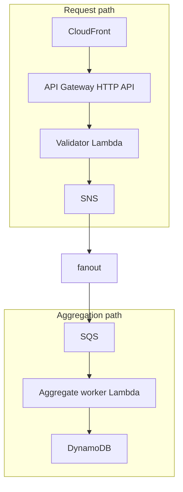

## Premise

Imagine you have a small serverless backend for your application. The backend is implemented using AWS Lambda, and the handlers are small: they parse a request, call one AWS service, and return a response.
After deploying the backend, you notice that some requests are very slow. You check CloudWatch metrics and see that cold start are taking a long time.

This is annoying for several reasons:
  - Cold start is not free: AWS bills for the time spent in the Lambda runtime, even if your
    code does not run yet.
  - Cold start affects user experience: if a user hits a cold Lambda, they will wait longer for the response.


In this blog app, that backend handles post view analytics. The write path accepts a
view event, sends it through SNS and SQS, and updates a DynamoDB counter:



SNS currently has only one subscriber. Later, another SQS queue with a different
Lambda will be added to save detailed events to S3 for analytics and reporting.

There is also a read-side Lambda used by the blog page to fetch the current
view count from DynamoDB. The page does not wait for this request; it renders
normally with `Views: ...` and updates the value asynchronously.

The first implementation used Python 3.12 for all backend Lambda handlers. It
was simple and easy to write, but the handlers did not do much work: mostly JSON
parsing and one AWS SDK call.

## The problem

For this kind of Lambda, runtime overhead can be a meaningful part of the total
request time.

The code itself was not complex enough to justify a larger framework or a more
complicated architecture. The question was simpler: if these handlers are small,
latency-sensitive, and mostly call AWS services, would Go improve performance and
reduce costs enough to be worth the migration?

## The solution

I rewrote the three backend Lambda handlers in Go:

- `analytics_validator`: accepts a post view request and publishes an SNS event
- `aggregate_views`: consumes SQS messages and increments the DynamoDB counter
- `get_views`: reads the current DynamoDB counter for a post

All three now run as custom `provided.al2023` runtimes on `arm64`, with 512 MB
configured memory.

## Practical example

After deploying the Go handlers, I compared Lambda report rows from CloudWatch.
The useful fields were:

- `Duration`
- `Billed Duration`
- configured memory
- max memory used

These numbers include real AWS service calls, so they are more useful for this
case than a local microbenchmark.

### Validator Lambda

The validator is on the request path before SNS.

```sh
Python cold-ish: 656.50 ms duration, 741 ms billed, 1024 MB configured, 92 MB max memory
Python warm:      18.04 ms duration,  19 ms billed, 1024 MB configured, 92 MB max memory

Go cold-ish:     133.24 ms duration, 205 ms billed, 1024 MB configured, 37 MB max memory
Go warm:          11.86 ms duration,  12 ms billed, 1024 MB configured, 37 MB max memory
```

The cold-ish request was about 80% faster, and the warm request was about 34%
faster.

### Aggregate worker Lambda

The worker consumes SQS events and updates DynamoDB.

```sh
Python cold-ish: 1355.28 ms duration, 1439 ms billed, 512 MB configured, 94 MB max memory
Python warm:        7.04 ms duration,    8 ms billed, 512 MB configured, 94 MB max memory

Go cold-ish:      251.23 ms duration,  322 ms billed, 512 MB configured, 37 MB max memory
Go warm:            4.43 ms duration,    5 ms billed, 512 MB configured, 37 MB max memory
```

The cold-ish request was about 81% faster, and the warm request was about 37%
faster.

### Read-side views Lambda

The read Lambda fetches one item from DynamoDB. CloudFront caches this endpoint
for a short window, so repeat reads often avoid Lambda entirely.

```sh
Python cold-ish: 919.00 ms duration, 1025 ms billed, 768 MB configured, 93 MB max memory
Python warm:      39.28 ms duration,   40 ms billed, 768 MB configured, 94 MB max memory

Go cold-ish:     253.35 ms duration,  325 ms billed, 512 MB configured, 40 MB max memory
Go warm:          22.00 ms duration,   23 ms billed, 512 MB configured, 42 MB max memory
```

The cold-ish request was about 72% faster, and the warm request was about 44%
faster, while using 512 MB configured memory instead of the earlier 768 MB.

## Memory right-sizing

For the validator, I also tested smaller memory settings:

```sh
128 MB configured cold-ish: 1299.71 ms duration, 1366 ms billed, 34 MB max memory
128 MB configured warm:       21.26 ms duration,   22 ms billed, 34 MB max memory

256 MB configured cold-ish:  624.80 ms duration,  705 ms billed, 33 MB max memory
256 MB configured warm:       16.50 ms duration,   17 ms billed, 33 MB max memory

512 MB configured cold-ish:  202.95 ms duration,  257 ms billed, 38 MB max memory
512 MB configured warm:       14.64 ms duration,   15 ms billed, 38 MB max memory
```

The function used far less than 512 MB of memory, but Lambda CPU allocation
scales with configured memory. In this case, 512 MB was the better latency
baseline than 128 MB or 256 MB, especially for cold starts.

This is why the configured memory matters even when the function does not need
that much RAM. Lower memory can be cheaper per millisecond, but it also gets
less CPU and can take more milliseconds. The useful comparison is billed
duration at each memory setting, not max memory used alone.

## Conclusion

For these handlers, Go was worth it. The biggest improvement was cold start
duration, but warm duration and max memory also improved.

This is not a rule that every Lambda should be Go. It worked here because the
functions are small, latency-sensitive, and mostly do one AWS SDK call. The next
step is to keep watching CloudWatch p95 and p99 duration after real traffic
instead of treating one benchmark run as the final answer.
