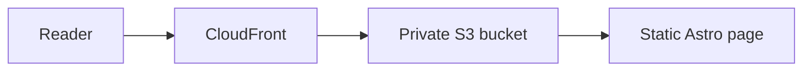
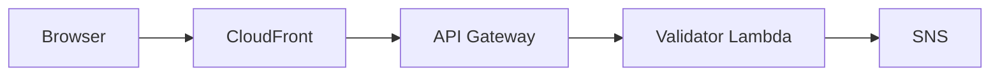
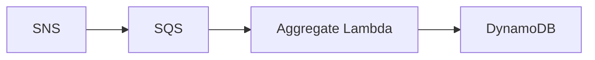
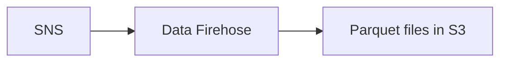
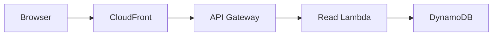
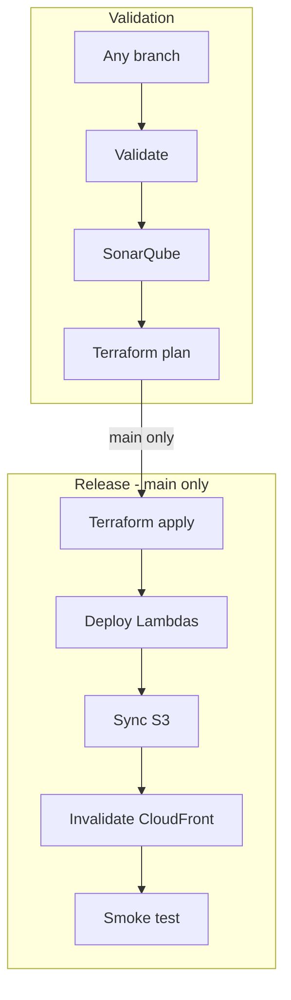

## Premise

Imagine you want to publish a technical blog. The simplest useful version is a
static site deployed behind a CDN. It is fast, cheap, and has very little to
operate.

The goal of this blog started with a stricter version of that idea: every
article had to be available as a static asset. A reader, search engine, web
crawler, or LLM crawler should receive the complete post without running a
client-side application or calling a backend.

Then the requirements grew slightly. I wanted a view counter on every post,
raw analytics data for later analysis, infrastructure as code, and a deployment
pipeline that could safely run from pull requests and the `main` branch.

That is the premise of this blog. The public site remains static, while the
dynamic parts are isolated in a small serverless backend. Jenkins runs on my
on-premises Kubernetes cluster, and AWS hosts the application infrastructure.

## The problem

The main architectural requirement was to keep publishing and reading posts
independent from both JavaScript and the application backend.

If the view counter fails, a reader should still get the article. If an
analytics consumer is slow, the request that records a view should not wait for
it. If a pull request changes Terraform, Jenkins should be able to show the
plan without receiving permission to deploy it.

This leads to three separate paths:

- a static content path for serving the site
- an asynchronous analytics path for recording and processing views
- a CI/CD path for validating and deploying changes

## Why static assets were the hard constraint

For every public URL, the first response contains the complete article as
semantic HTML. The client does not need to hydrate a component tree, call a
content API, or wait for a client-side router before it can discover the title,
headings, links, and body text.

This matters because not every consumer behaves like a modern browser. Search
engines, archival tools, simple web crawlers, and LLM readers have different
levels of JavaScript support. Returning the content directly in HTML gives all
of them the same document and makes the site easier to index, quote, archive,
and read.

An SPA can also be hosted from static files, but that was not enough for this
goal. If the initial HTML is only an application shell and JavaScript must
construct the article, then the content still depends on a runtime and often a
backend API. This blog deliberately avoids that design.

Astro produces one HTML asset for every page. CSS, the small analytics script,
images, RSS, and the sitemap are also build artifacts uploaded to S3. JavaScript
adds the view counter as progressive enhancement; disabling it, blocking the
API, or losing the analytics backend does not remove the article or its
navigation and metadata.

This constraint shaped the rest of the architecture. The backend sits beside
the content path instead of underneath it. The cost is that publishing requires
a new build and deployment, which is a good tradeoff for a blog whose content
changes much less often than it is read.

## Architecture at a glance

<figure className="architecture-figure">
  
  <figcaption>
    End-to-end architecture: GitHub triggers Jenkins on Kubernetes, Jenkins
    validates and deploys the application, and CloudFront serves both the
    static site and the serverless views API. Open the diagram for the
    full-size version.
  </figcaption>
</figure>

The diagram is split into two ownership areas. The on-premises platform runs
Jenkins and its ephemeral build agents. AWS contains a small platform boundary
for CI/CD access and Terraform state, plus the application resources used by
the blog itself.

## Serving the static site

The frontend is built with Astro. At build time, Astro turns the posts into
HTML, CSS, JavaScript, RSS, and sitemap files. Jenkins uploads those files to a
private S3 bucket.

CloudFront is the only public entry point. It reads the private bucket through
an origin access control, caches the static assets, terminates TLS, and adds the
site's security headers. A small CloudFront Function rewrites clean URLs such
as `/posts/example` to the corresponding `index.html` object in S3.

There is no server-side rendering and no application server in the page
delivery path:

<figure>

<figcaption>
Static content path: CloudFront serves the Astro page stored as an S3 object.
</figcaption>

</figure>

That is the most important simplification in the architecture. Publishing a
new article requires a build and deployment, but serving it does not require a
running container, Lambda invocation, or database query.

## Recording a post view

Each post loads a small client-side script after the page has rendered. The
script sends a `POST` request to `/api/views/{slug}` and uses `localStorage` to
avoid recording the same post repeatedly in one browser.

CloudFront routes `/api/*` to API Gateway instead of S3. The validator Lambda
checks the request origin, verifies that the slug belongs to a real post, and
publishes a normalized event to SNS. It returns as soon as SNS accepts the
event.

<figure>

<figcaption>
View ingestion path: the validator checks the request before publishing an SNS
event.
</figcaption>

</figure>

The counter is intentionally approximate. Clearing browser storage, using a
different browser, or blocking the request changes what gets counted. That is
acceptable here because the number is a lightweight signal, not billing or
security data.

## Processing analytics asynchronously

SNS fans each accepted view event out to two destinations.

The first destination is SQS. An aggregate Lambda consumes messages in batches
and atomically increments the counter for the post in DynamoDB. SQS absorbs
short processing failures and retries messages; after repeated failures, they
move to a dead-letter queue for inspection.

<figure>

<figcaption>
Counter path: SQS buffers view events before DynamoDB is updated.
</figcaption>

</figure>

The second destination is Amazon Data Firehose. Firehose buffers the JSON
events, converts them to Parquet using the Glue schema, and writes date-based
partitions to a separate private S3 bucket.

<figure>

<figcaption>
Raw analytics path: Firehose converts buffered events to Parquet in S3.
</figcaption>

</figure>

SNS is useful here because the request-side Lambda knows only how to publish an
event. Adding the raw-data path did not require changing the validator or the
counter worker. SQS protects the counter path from short failures, while
Firehose handles buffering and file conversion without another custom Lambda.

The tradeoff is eventual consistency. A successful `POST` means the event was
accepted, not that DynamoDB was already updated. For a blog view counter, that
delay is preferable to making the reader's request wait for every downstream
step.

## Reading the current counter

The same client-side script also sends a `GET` request for the current number of
views. CloudFront forwards a cache miss to API Gateway, the read Lambda fetches
one DynamoDB item, and the page replaces `Views: ...` with the returned value.

<figure>

<figcaption>
Counter read path: CloudFront can cache the value returned from DynamoDB.
</figcaption>

</figure>

CloudFront caches successful view reads for five seconds. More importantly,
the page does not wait for this request before displaying the article. A failed
analytics read leaves the placeholder in place and does not affect the static
content.

## Building and deploying the application

A GitHub webhook starts the Jenkins multibranch pipeline. Jenkins provisions
ephemeral agent Pods in the on-premises Kubernetes cluster instead of keeping a
permanent build machine for this repository.

Frontend and backend validation run in parallel. The frontend path installs
locked dependencies, scans packages, lints the source, and builds Astro. The
backend path verifies Go modules, scans for vulnerabilities, tests the Lambda
handlers, and builds the Lambda artifacts. SonarQube then checks the frontend,
backend, and Terraform code before Jenkins produces a Terraform plan.

Every branch can validate the application and assume a read-only AWS plan role.
Only `main` can continue to the release stages:

<figure>

<figcaption>
Delivery path: every branch reaches Terraform plan, but only `main` reaches the
release stages.
</figcaption>

</figure>

The release reuses checksummed artifacts produced earlier in the same build.
It does not rebuild the site or Lambda binaries after the Terraform plan. The
final smoke test checks a deployment identifier embedded in the site, so the
pipeline verifies that CloudFront is serving the commit it just released.

## AWS access without stored keys

Jenkins does not store a long-lived AWS access key for this application. It
acts as an OIDC issuer, and AWS STS exchanges a job-specific token for temporary
credentials.

There are two roles:

- the plan role can be assumed by branch and pull request jobs and has
  read-only access
- the deploy role can be assumed only by the protected `main` job and can
  change infrastructure and publish application artifacts

This makes the Git branch part of the deployment boundary. A pull request can
show what Terraform would change, but it cannot apply that plan or update the
site. The details of this flow are covered in [How to securely handle CI/CD
access to AWS?](/posts/jenkins-aws-oidc/).

## Why Terraform is split from application deployment

Terraform owns the AWS resource definitions: CloudFront, S3, API Gateway,
Lambda configuration, SNS, SQS, DynamoDB, Firehose, Glue, and IAM policies. Its
remote state is stored in the AWS platform area shown in the diagram.

Lambda code and static site files change more often than the infrastructure.
After `terraform apply`, the pipeline therefore deploys the prebuilt Lambda
archives and syncs the Astro output directly. Terraform keeps ownership of the
resource shape, while the deployment scripts update the application payloads.

## Tradeoffs

This is more infrastructure than a blog needs if the only requirement is to
publish articles. Astro, S3, and CloudFront would be enough for that.

The additional pieces exist because this repository is also a practical case
study for serverless analytics, infrastructure as code, workload identity, and
a Kubernetes-based CI/CD platform. Even so, the application path stays small:
three Go Lambdas, one DynamoDB table, and managed AWS services between them.

The architecture deliberately avoids an always-on backend, a relational
database, and custom analytics processors. Those would add operational work
without improving the current use case.

## Conclusion

The design starts with a static site and adds dynamic behavior around it rather
than through it. CloudFront and S3 serve the articles, so analytics failures do
not take the content down. SNS, SQS, and Firehose decouple view collection from
its consumers. Jenkins, OIDC, branch-specific roles, and Terraform make the
deployment path reproducible without giving every branch production access.

For this blog, that is the useful balance: the reading path remains boring and
reliable, while the surrounding platform is complex enough to exercise the
same patterns used in larger systems.
