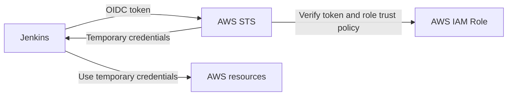
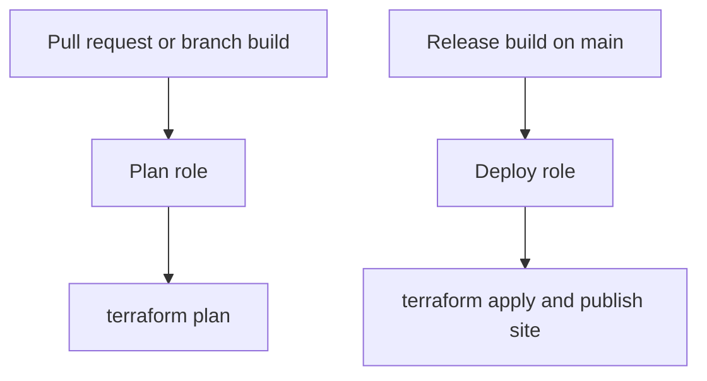

## Premise

Imagine you are a developer and have a static site in a GitHub repository. That site is deployed to a chosen cloud provider, in this case AWS.
After deploying it ten times manually, you decide to automate the process with Jenkins.
You also adopted modern IAC practices and use Terraform to manage the infrastructure.
You want to build the site and deploy it to AWS on every push to `main`.

## The problem

In order to deploy to AWS or manage AWS resources, Jenkins needs credentials.
The simplest way to provide them is to create an IAM user with programmatic access and store the access key and secret in Jenkins credentials.
This is a bad idea for several reasons:

- The credentials are long-lived and can be leaked or misused.
- The credentials are not tied to a specific branch, so if you have branches with different trust levels, they can't easily be separated.
- The credentials are not tied to a specific job, so if you have multiple jobs in Jenkins, they can't easily be separated.

We could theoretically create multiple IAM users and store their credentials in Jenkins, but that would be cumbersome and error-prone.
AWS best practices for credentials management recommend using roles instead of users, and using short-lived credentials instead of long-lived ones for automation.

## The solution

AWS supports OpenID Connect (OIDC) federation, which allows Jenkins to assume an IAM role without storing long-lived credentials.

### What is OIDC and how does it work?

In short, OIDC is a protocol that lets one system prove its identity to another
system without sharing a long-lived secret.

To solve the problem of Jenkins needing AWS credentials, we can create an IAM role in AWS that trusts the Jenkins OIDC provider.
When a build runs, Jenkins will request temporary credentials for that role from AWS STS (Security Token Service) using an OIDC token.
The Jenkins side can be handled with the [OpenID Connect Provider plugin](https://plugins.jenkins.io/oidc-provider/), which issues build ID tokens that can be exposed to pipelines through Jenkins credentials.
The credential stores the configuration for requesting a token; the token itself is generated for the build and exposed as a temporary file.

The flow is: Jenkins gets an OIDC token for the current job, AWS STS verifies that token against the role trust policy, and AWS returns temporary credentials that the build can use.

<figure>



<figcaption>
Authentication flow: Jenkins sends its job-specific OIDC token to AWS STS. STS
checks the token and IAM role trust policy, returns temporary credentials, and
Jenkins uses those credentials to access AWS resources.
</figcaption>

</figure>

### How is it better than storing credentials in Jenkins?

- The credentials are short-lived and automatically expire, which limits the blast radius if they leak
- AWS only issues credentials when the OIDC token matches the role trust policy
- The trust policy can match specific Jenkins job subjects, so different jobs or branches can use different roles

In short, using OIDC federation is a more secure and flexible way to let Jenkins deploy to AWS without storing long-lived access keys.

## Practical example

In [this blog app repository](https://github.com/kerbatek/mrembiasz-blog), we have a Jenkins pipeline that builds a static site and deploys it to AWS S3 and CloudFront.
The pipeline is defined in `deploy/Jenkinsfile`.

The pipeline has two stages that require AWS credentials:

- `Terraform Plan`: This stage runs `terraform plan` to check what changes would be made to the infrastructure. It uses the `mrembiasz-blog-jenkins-plan` role.
- `Release`: This stage runs `terraform apply` to apply the changes and deploy the static site. It uses the `mrembiasz-blog-jenkins-deploy` role.

The two roles are defined in Terraform in a private platform repository. The plan role is non-destructive and can be assumed by any Jenkins job for this repository, while the deploy role is destructive and can only be assumed by the `main` Jenkins job.
The plan role trusts all Jenkins subjects for this repository's PR and branch jobs, while the deploy role trusts only the `main` Jenkins subject.

The split looks like this: pull requests get enough access to produce a Terraform plan, while the protected `main` branch gets the permissions needed to apply infrastructure changes and publish the site.

<figure>



<figcaption>
Authorization split: pull request and branch builds assume the plan role and
can only run `terraform plan`; the release build on `main` assumes the deploy
role and can run `terraform apply` and publish the site.
</figcaption>

</figure>

## What Jenkins passes to AWS tools

The Jenkins stage does not manually call STS. It only sets two environment variables:

```sh
AWS_ROLE_ARN=arn:aws:iam::047588357922:role/mrembiasz-blog-jenkins-plan
AWS_WEB_IDENTITY_TOKEN_FILE=/path/to/jenkins/oidc-token
```

The AWS CLI and Terraform AWS provider understand these variables. They call `AssumeRoleWithWebIdentity` automatically and use the temporary credentials for the command.

## Trust policy and permissions are separate

There are two policies involved:

- The trust policy decides who can assume the role.
- The permissions policy decides what the role can do after it is assumed.

The trust policy is checked before AWS gives the build any credentials. In this case it answers questions like: is this token really from my Jenkins OIDC provider, and is it coming from the `main` job or from a pull request job?

For a deploy role, the trust policy can be strict and accept only the `main` Jenkins job subject:

```json
{
  "Version": "2012-10-17",
  "Statement": [
    {
      "Effect": "Allow",
      "Principal": {
        "Federated": "arn:aws:iam::047588357922:oidc-provider/jenkins.mrembiasz.pl/oidc"
      },
      "Action": ["sts:TagSession", "sts:AssumeRoleWithWebIdentity"],
      "Condition": {
        "StringEquals": {
          "jenkins.mrembiasz.pl/oidc:aud": "sts.amazonaws.com",
          "jenkins.mrembiasz.pl/oidc:sub": "https://jenkins.mrembiasz.pl/job/mrembiasz-blog/job/main/"
        }
      }
    }
  ]
}
```

The `aud` claim says the token is meant for AWS STS. The `sub` claim says which Jenkins job the token represents.

The permissions policy is checked after the role has been assumed. It answers a different question: now that this build has credentials, can it read Terraform state, create CloudFront invalidations, upload objects to S3, or change IAM?

Both policies need to be managed carefully. The trust policy prevents the wrong Jenkins job from getting the role. The permissions policy limits the damage if the right job, or the code running inside it, does something unexpected.

## How to test that it works

A useful test is to intentionally try to assume the deploy role from a pull request build. AWS should reject it with:

```sh
AccessDenied: Not authorized to perform sts:AssumeRoleWithWebIdentity
```

That failure is expected and confirms that the trust policy is working correctly.

## Conclusion

OIDC does not make Jenkins magically trusted. It gives AWS enough context to decide which Jenkins job is asking for access and which IAM role, if any, that job is allowed to assume.

For this blog, that means pull requests can validate the site and produce Terraform plans, but only the protected `main` pipeline can change AWS infrastructure or publish the website. Jenkins gets temporary credentials when it needs them, and there are no long-lived AWS access keys sitting in the CI system.
